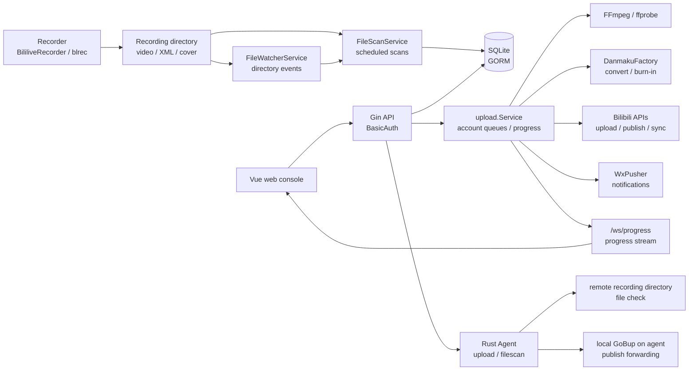

# GoBup Architecture

[中文](architecture.md) | [README](../README.en.md)

## Components

GoBup has four main layers:

- Web frontend: `web/`, Vue 3, Vite, Element Plus.
- HTTP backend: `server/`, Gin routes, controllers, and services.
- Data layer: GORM + SQLite. The database defaults to `data/gobup.db` or `/app/data/gobup.db` in Docker.
- Rust Agent: `server/agent/`, installable as a remote upload publisher, recording-file checker, or both.
- External tools: FFmpeg, ffprobe, DanmakuFactory, Bilibili HTTP APIs, and WxPusher.

Production builds embed `web/dist` into the Go binary. Development mode can run frontend and backend separately.

## Architecture Diagram



## Layout

```text
server/internal/controllers  HTTP controllers
server/internal/routes       API routes and embedded frontend assets
server/internal/models       GORM models
server/internal/services     scanning, scan metadata, file ops, danmaku, video processing, sync jobs
server/internal/upload       upload queues, progress, publishing flow, burned-part backfill
server/internal/bili         Bilibili clients, uploaders, rate limiters
server/agent                 Rust Agent HTTP service
server/assets/agent          embedded Agent installer and release packages
scripts/install_agent.sh     one-click Agent installer
web/src/views                pages
web/src/components           reusable components
```

## Data Model

Important tables:

- `record_rooms`: room settings, publish templates, upload strategy, file operation policy, danmaku burn settings.
- `record_histories`: one recording or livestream session.
- `record_history_parts`: parts, split files, danmaku-burned files, and upload state.
- `bili_bili_users`: admin account and Bilibili accounts, including Cookie, access key, expiry time, enabled state, and daily upload quota.
- `system_configs`: scan, file watcher, data repair, proxy, Agent purpose, installer source, and remote endpoint settings.

The project supports deleting the SQLite database and initializing a fresh schema. Current initialization uses GORM AutoMigrate plus only necessary compatibility adjustments.

## Scanning And Watching

`FileScanService` is the single import path. It:

- Traverses the work path and custom scan paths.
- Checks extension, file size, file age, duplicate records, and temporary file names.
- Creates histories and parts.

`FileWatcherService` uses fsnotify to watch the work path and custom directories. It does not write the database directly. It debounces video file events and triggers `ScanAndImport`. Scheduled scans remain as a fallback for Docker mounts, network storage, and missed OS events.

## Upload Pipeline

Manual uploads, auto uploads, queue status, and WebSocket progress use one shared `upload.Service` instance.

Flow:

1. A scheduled job or API calls `UploadPart`.
2. The room strategy selects an upload account: fixed, round-robin, shortest queue, or daily remaining quota.
3. Upload window and rate-limit cooldown are checked.
4. Large files are split when the part count would exceed the upload limit.
5. Optional FFmpeg pre-upload transcoding runs with room-level H.264/H.265 selection and reports into the upload progress stream. If FFmpeg is unavailable or transcoding fails, temporary files are cleaned up and the original file is uploaded.
6. A Bilibili client is created for the selected account and uploads the file.
7. CID, upload line, retry counters, and error messages are saved.
8. Danmaku burn-in, file operations, and auto-publish may run.

Clients are not reused across accounts or tasks, which prevents Cookie, access token, or request-context leakage.

Upload requests default to a 30-minute timeout and can be adjusted with `GOBUP_UPLOAD_TIMEOUT_MINUTES`. TLS handshake timeout can be adjusted with `GOBUP_TLS_HANDSHAKE_TIMEOUT_SECONDS`. UPOS upload retries parse `Retry-After` on 429 responses and prefer the server-provided cooldown before retrying. Part failures persist `uploadErrorType` to distinguish network, rate-limit, auth, file, transcode, window, and user-operation errors.

WebSocket connections are same-origin by default. Reverse proxies or cross-origin consoles can add exact origins through `GOBUP_ALLOWED_ORIGINS`; wildcard `*` is ignored. The frontend first gets a short-lived token from authenticated `/api/progress/ws-token`, then connects to `/ws/progress`.

Bilibili TV QR login and refresh-token signing use `BILI_APP_KEY` and `BILI_APP_SECRET` environment variables. When they are missing, those flows return explicit errors; no AppSecret is embedded in code.

Parts also have persisted pause and cancel states. Automatic scheduling, manual upload endpoints, and queue workers skip paused or cancelled parts. Resume and retry clear those states and enqueue the part again when conditions allow. Tasks submitted outside the upload window remain in the queue flow and are re-enqueued when the next window starts.

The daily quota strategy reads each account's `dailyUploadQuota`. `0` means unlimited; positive values are compared against today's uploaded parts and current queue length, so exhausted limited accounts are skipped and the account with the most remaining capacity is preferred.

## Publish And Covers

Publishing lives in `server/internal/upload/publish.go`; burned danmaku part backfill for already published videos is split into same-package `publish_burned_append.go`. Cover modes:

- Default cover.
- Live room cover.
- Video frame cover.
- Manual cover.

Frame extraction uses FFmpeg and writes a `.cover.jpg` next to the source video. Live cover can fall back to frame extraction when configured.

## Rust Agent

The Rust Agent is the standalone `gobup-agent` binary. It protects `/agent/v1/*` endpoints with a token and enables capabilities according to the installed purpose:

- `upload`: receives publish requests from the controller and forwards them to `/agent/v1/publish` on the Agent machine's local GoBup service, so publishing runs where the account and file context live.
- `filescan`: scans the Agent machine's recording directory and returns file count, total size, sample files, and scan errors without writing the database or deleting files.
- `both`: enables both capabilities.

The controller exposes public download routes at `/agent/install-agent.sh` and `/agent/releases/gobup-agent-linux-*.tar.gz`. The release workflow builds Linux amd64/arm64 Rust Agent packages, copies them into `server/assets/agent`, and then builds the embedded Go server. If a package is not embedded, the controller download route redirects to GitHub Releases. The installer supports `controller`, `github`, and `cdn` sources and writes token, purpose, listen address, recording path, and local upstream GoBup URL to `/opt/gobup/agent/env`.

## Danmaku Processing

`DanmakuBurnService` wraps DanmakuFactory and FFmpeg:

- Locate the XML danmaku file.
- Convert XML to ASS with DanmakuFactory.
- Apply video resolution plus room-level font size, color, scroll area, and display area settings.
- Burn ASS into MP4 with FFmpeg.
- Create a `danmaku_burn` temporary part and enqueue it for upload.

Danmaku sending and danmaku burn-in share the danmaku progress API. Burn-in progress exposes `stage`, `message`, `failed`, and update time. Burn failures are logged and the original upload continues. A review-backfill task can later detect missing burned parts and append them.

## File Operations

`FileMoverService` can delete, move, or copy files at these triggers:

- After part upload.
- Before publish when all parts are uploaded.
- After successful publish.
- After review approval.

Scope is a bitmask: video, danmaku, cover. Delayed operations write `scheduled_delete_at` and are consumed by scheduled jobs.

## WebSocket And Queue APIs

Endpoints:

- `/api/queue/upload/status`: upload queue summary, pending, running, paused, cancelled, and completed lists.
- `/api/queue/upload/part/:id/pause|resume|cancel|retry`: controls a single upload task.
- `/api/queue/upload/pauseAll|resumeAll|cancelAll`: batch controls for not-yet-started or paused upload tasks.
- `/api/progress/ws-token`: issues short-lived WebSocket tokens.
- `/ws/progress`: upload progress snapshots.
- `/api/history/export`: CSV export with current filters.
- `/api/swagger/index.html`: Swagger UI, available only after administrator BasicAuth succeeds.

The upload queue response includes part file, time, cooldown, temporary-file, and last-error details. The Dashboard shows queue state and a details dialog. The History page uses reconnecting WebSocket updates with polling fallback. Directory events only debounce-scan created, written, or renamed video files; new directory events extend recursive watching.

## Build And CI

- `make build`: frontend plus non-embedded backend.
- `make build-embed`: production binary with embedded frontend.
- `make build-cross`: production binaries for linux/darwin/windows amd64/arm64 combinations.
- `make build-agent`: builds the Rust Agent and produces `gobup-agent-linux-*.tar.gz` controller distribution packages.
- Dockerfiles use Node.js 24 and Go 1.25.
- GitHub Actions opt into Node.js 24 with `FORCE_JAVASCRIPT_ACTIONS_TO_NODE24=true`.
- CI runs `swag init --parseDependency --parseInternal` to verify that Swagger/OpenAPI generated files in `server/docs` stay synchronized, and checks API route coverage stays at or above 90%.

## Operations

- Back up `/app/data/gobup.db` regularly.
- Make sure the recorder and GoBup container see the same recording directory.
- Test move or copy policies before enabling deletion.
- Multi-account load balancing is useful for upload distribution. Daily quotas help cap per-account part counts. Auto-publish should still use a fixed publishing account.
- Config export redacts account credentials by default. Full account backups require explicitly including secrets and should be stored as sensitive files.
