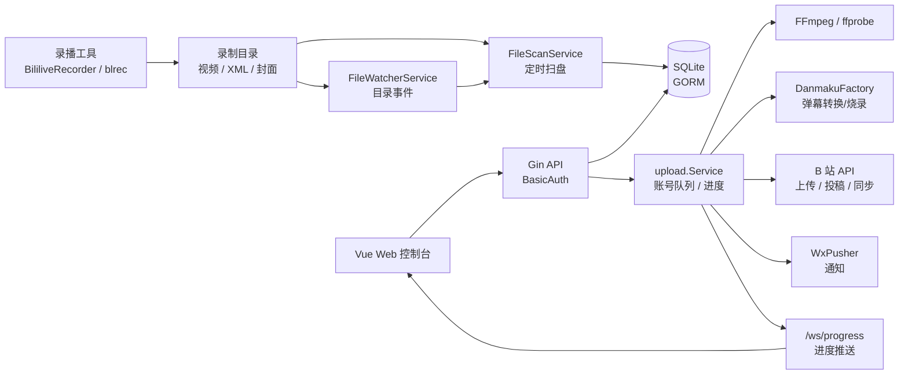

# GoBup 架构说明

[English](architecture.en.md) | [README](../README.md)

## 组件

GoBup 由四层组成：

- Web 前端：`web/`，Vue 3、Vite、Element Plus。
- HTTP 后端：`server/`，Gin 路由、控制器、服务层。
- 数据层：GORM + SQLite，数据库默认位于 `data/gobup.db` 或 Docker 的 `/app/data/gobup.db`。
- 外部工具：FFmpeg、ffprobe、DanmakuFactory、B 站 HTTP API、WxPusher。

生产镜像使用 Go embed 将 `web/dist` 嵌入后端二进制。开发模式下前后端可以分别运行。

## 架构图



## 目录

```text
server/internal/controllers  HTTP 控制器
server/internal/routes       API 路由和嵌入前端静态资源
server/internal/models       GORM 模型
server/internal/services     扫盘、扫盘元数据、文件操作、弹幕、视频处理、同步任务
server/internal/upload       上传队列、上传进度、投稿流程、烧录版回补追加
server/internal/bili         B 站客户端、上传器、限流器
web/src/views                页面
web/src/components           可复用组件
```

## 数据模型

核心表：

- `record_rooms`：房间配置、投稿模板、上传策略、文件操作策略、弹幕烧录配置。
- `record_histories`：一次直播或录制会话。
- `record_history_parts`：分P、切分文件、弹幕烧录文件和上传状态。
- `bili_bili_users`：管理员账号和 B 站账号，B 站账号包含 Cookie、access key、过期时间、启用状态和每日上传配额。
- `system_configs`：扫盘、文件监控、数据修复、代理池等系统级配置。

项目默认允许删除 SQLite 文件重新初始化。当前结构通过 GORM AutoMigrate 初始化，历史兼容只保留必要的字段迁移。

## 扫盘和文件监控

`FileScanService` 是唯一入库入口，负责：

- 遍历工作目录和自定义扫描目录。
- 检查扩展名、文件大小、文件年龄、重复记录和临时文件命名。
- 创建历史记录和分P。

`FileWatcherService` 使用 fsnotify 监听工作目录和自定义目录。它不会直接写库，只在检测到视频文件变化后延迟触发 `ScanAndImport`。定时扫盘仍作为兜底，解决 Docker 挂载、网络盘或操作系统事件丢失问题。

## 上传流程

上传入口统一到同一个 `upload.Service` 实例，手动上传、自动上传、队列查询和 WebSocket 进度共用同一套队列。

流程：

1. 自动任务或接口调用 `UploadPart`。
2. 根据房间策略选择上传账号：固定账号、轮询、最短队列、每日剩余配额。
3. 检查上传时间窗口和速率限制冷却。
4. 必要时切分大文件，避免单文件分片过多。
5. 可选执行 FFmpeg 预转码压缩，支持按房间选择 H.264/H.265，并把转码阶段写入上传进度；FFmpeg 不可用或转码失败时会清理临时文件并继续上传原文件。
6. 使用选定账号创建独立 B 站客户端并上传。
7. 写入 CID、上传线路、重试信息和错误原因。
8. 可选触发弹幕烧录、文件操作和自动投稿。

账号客户端不跨任务复用，避免 Cookie、access token 或请求上下文串扰。

上传请求默认超时 30 分钟，可通过 `GOBUP_UPLOAD_TIMEOUT_MINUTES` 调整；TLS 握手超时可通过 `GOBUP_TLS_HANDSHAKE_TIMEOUT_SECONDS` 调整。UPOS 上传在遇到 429 时会解析 `Retry-After` 响应头，并优先使用服务端提示的冷却时间重试。分P失败会同步保存 `uploadErrorType`，用于区分网络、限流、鉴权、文件、转码、窗口和用户操作错误。

WebSocket 默认只接受同源连接；反向代理或跨域控制台可以通过 `GOBUP_ALLOWED_ORIGINS` 追加精确 Origin，通配符 `*` 会被忽略。前端会先通过已认证的 `/api/progress/ws-token` 获取短期 token，再连接 `/ws/progress`。

B 站 TV 二维码登录和 refresh token 刷新签名使用 `BILI_APP_KEY`、`BILI_APP_SECRET` 环境变量；未配置时相关功能会返回明确错误，不在代码中内置 AppSecret。

上传分P还支持持久化的暂停和取消状态。自动调度、手动上传入口和队列消费都会跳过已暂停或已取消的分P；恢复或重试会清除这些状态并在条件允许时重新入队。上传窗口外提交的任务会留在队列体系内，按下一个窗口开始时间延迟重新入队。

每日配额策略会读取账号 `dailyUploadQuota`。`0` 表示不限额；大于 `0` 时会用当日已上传分P数和当前账号队列长度估算剩余额度，优先选择剩余额度最高的账号，已用尽的限额账号会被跳过。

## 投稿和封面

投稿逻辑位于 `server/internal/upload/publish.go`；弹幕烧录后的已投稿视频回补追加逻辑拆分在同包 `publish_burned_append.go`。封面支持：

- 默认封面。
- 直播封面。
- 视频帧截取封面。
- 手动上传封面。

帧截取使用 FFmpeg，输出与视频同目录的 `.cover.jpg`。直播封面缺失时可以按房间配置退化为帧截取。

## 弹幕处理

弹幕烧录由 `DanmakuBurnService` 封装：

- 查找 XML 弹幕文件。
- 调用 DanmakuFactory 转 ASS。
- 按视频分辨率和房间级字号、颜色、滚动区域、显示区域参数生成弹幕样式。
- 调用 FFmpeg 将 ASS 烧录到 MP4。
- 创建 `danmaku_burn` 临时分P并加入上传队列。

弹幕发送和弹幕烧录共用弹幕进度接口，烧录阶段会暴露 `stage`、`message`、`failed` 和更新时间。烧录失败只记录错误并继续原始视频上传。审核通过后的回补任务会检测缺失的弹幕版分P并尝试追加。

## 文件操作

`FileMoverService` 支持按触发点执行删除、移动、复制：

- 分P上传完成后。
- 全部分P上传完成且投稿前。
- 投稿成功后。
- 审核通过后。

作用域是位掩码：视频、弹幕、封面。延迟操作写入 `scheduled_delete_at`，由定时任务处理。

## WebSocket 和队列

接口：

- `/api/queue/upload/status`：上传队列概览、待上传、上传中、已暂停、已取消、已完成列表。
- `/api/queue/upload/part/:id/pause|resume|cancel|retry`：单个上传任务控制。
- `/api/queue/upload/pauseAll|resumeAll|cancelAll`：批量控制未开始或已暂停的上传任务。
- `/api/progress/ws-token`：签发短期 WebSocket token。
- `/ws/progress`：上传进度推送。
- `/api/history/export`：按筛选条件导出 CSV。
- `/api/swagger/index.html`：Swagger UI，仅在管理员 BasicAuth 通过后可访问。

上传队列响应包含分P文件、时间、冷却、临时文件和最近错误等详情字段。前端 Dashboard 展示队列概览和详情弹窗，History 页面使用可自动重连的 WebSocket 更新进度，并保留轮询兜底。目录事件监听只对创建、写入、重命名的视频文件触发延迟扫盘，新目录事件会补充递归监听。

## 构建和 CI

- `make build`：构建前端和非嵌入后端。
- `make build-embed`：构建嵌入式生产二进制。
- `make build-cross`：构建 linux/darwin/windows 的 amd64/arm64 生产二进制组合。
- Dockerfile 使用 Node.js 24 和 Go 1.25。
- GitHub Actions 使用 Node.js 24 运行环境，并设置 `FORCE_JAVASCRIPT_ACTIONS_TO_NODE24=true`。
- CI 会运行 `swag init --parseDependency --parseInternal` 校验 `server/docs` 中的 Swagger/OpenAPI 生成文件是否同步，并检查 API 路由覆盖率不低于 90%。

## 运维建议

- 定期备份 `/app/data/gobup.db`。
- 录播目录和 GoBup 容器应挂载同一宿主机目录。
- 启用自动删除前，先使用移动或复制策略确认路径正确。
- 多账号负载均衡适合上传任务分流；每日配额适合控制单账号分P数量；自动投稿建议配置固定投稿账号。
- 配置导出默认脱敏账号凭证，完整账号备份需显式选择包含密钥，并应按敏感文件保存。
